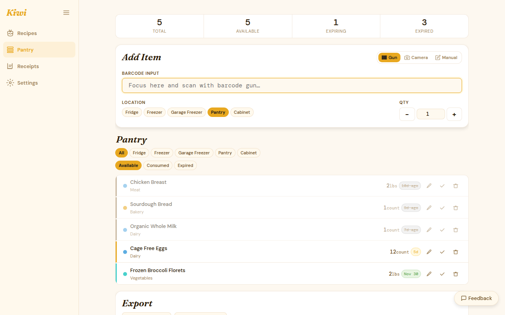
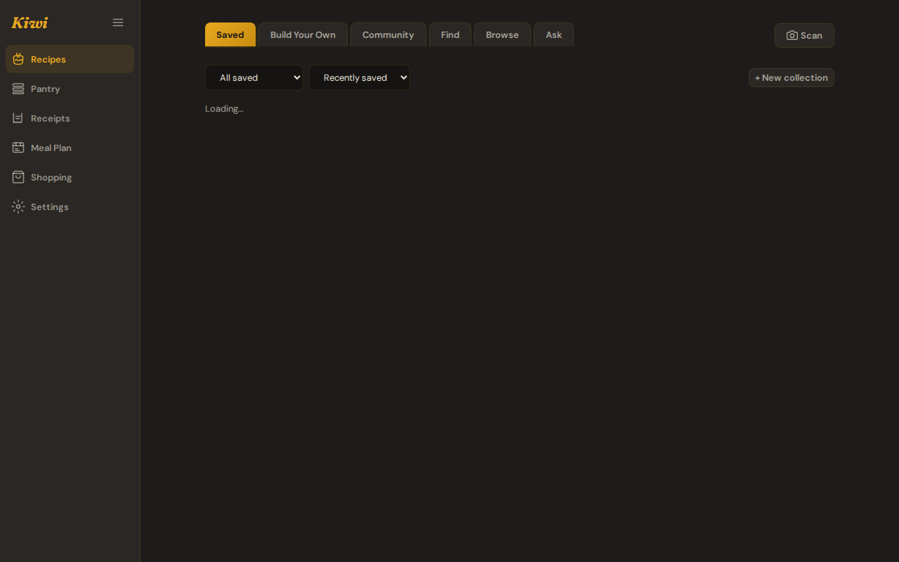

# Kiwi — Pantry Tracker

**Stop throwing food away. Cook what you already have.**

Kiwi tracks your pantry, watches for expiry dates, and suggests recipes based on what's about to go bad. Scan barcodes, photograph receipts, and let Kiwi tell you what to make for dinner — no LLM required.

{ .only-light }
{ .only-dark }

---

## What Kiwi does

- **Inventory tracking** — add items by barcode scan, receipt photo, or manual entry
- **Expiry alerts** — know what's about to go bad before it does
- **Recipe browser** — browse by cuisine, meal type, dietary preference, or main ingredient; see pantry match percentage inline
- **Leftover mode** — prioritize nearly-expired items when getting recipe suggestions
- **Receipt OCR** — extract line items from receipt photos automatically (Paid / BYOK)
- **Recipe suggestions** — four levels from pantry-match corpus to full LLM generation (Paid / BYOK)
- **Saved recipes** — bookmark any recipe with notes, 0–5 star rating, and style tags
- **CSV export** — export your full pantry inventory anytime

## Quick links

- [Installation](getting-started/installation.md) — local self-hosted setup
- [Quick Start](getting-started/quick-start.md) — add your first item and get a recipe
- [LLM Setup](getting-started/llm-setup.md) — unlock AI features with your own backend
- [Tier System](reference/tier-system.md) — what's free vs. paid

## No AI required

Inventory tracking, barcode scanning, expiry alerts, the recipe browser, saved recipes, and CSV export all work without any LLM configured. AI features (receipt OCR, recipe suggestions, style auto-classification) are optional and BYOK-unlockable at any tier.

## Free and open core

Discovery and pipeline code is MIT-licensed. AI features are BSL 1.1 — free for personal non-commercial self-hosting, commercial SaaS requires a license. See the [tier table](reference/tier-system.md) for the full breakdown.
