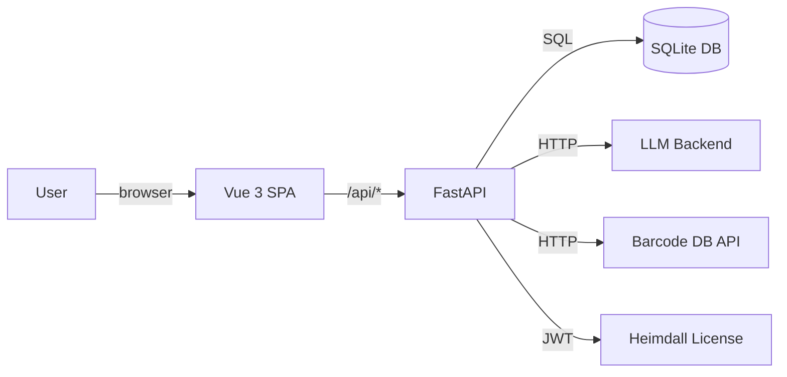

# Architecture

Kiwi is a self-contained Docker Compose stack with a Vue 3 (SPA) frontend and a FastAPI backend backed by SQLite.

## Stack

| Layer | Technology |
|-------|-----------|
| Frontend | Vue 3 + TypeScript + Vite |
| Backend | FastAPI (Python 3.11+) |
| Database | SQLite (via circuitforge-core) |
| Auth (cloud) | CF session cookie → Directus JWT |
| Licensing | Heimdall (RS256 JWT, offline-capable) |
| LLM inference | Pluggable — Ollama, vLLM, OpenAI-compatible |
| Barcode lookup | Open Food Facts / UPC Database API |
| OCR | LLM vision model (configurable) |

## Data flow



## Docker Compose services

```yaml
services:
  api:
    # FastAPI backend — network_mode: host in dev
    # Exposed at port 8512
  web:
    # Vue 3 SPA served by nginx
    # Exposed at port 8511
```

In development, the API uses host networking so nginx can reach it at `172.17.0.1:8512` (Docker bridge gateway).

## Database

SQLite at `./data/kiwi.db`. The schema is managed by numbered migration files in `app/db/migrations/`. Migrations run automatically on startup — the startup script applies any new `*.sql` files in order.

Key tables:

| Table | Purpose |
|-------|---------|
| `products` | Product catalog (shared, barcode-keyed) |
| `pantry_items` | User's pantry (quantity, expiry, notes) |
| `recipes` | Recipe corpus |
| `saved_recipes` | User-bookmarked recipes |
| `collections` | Named recipe collections (Paid) |
| `receipts` | Receipt uploads and OCR results |
| `user_preferences` | User settings (dietary, LLM config) |

## Cloud mode

In cloud mode (managed instance at `menagerie.circuitforge.tech/kiwi`), each user gets their own SQLite database isolated under `/devl/kiwi-cloud-data/<user_id>/kiwi.db`. The cloud compose stack adds:

- `CLOUD_MODE=true` environment variable
- Directus JWT validation for session resolution
- Heimdall tier check on AI feature endpoints

The same codebase runs in both local and cloud modes — the cloud session middleware is a thin wrapper around the local auth logic.

## LLM integration

Kiwi uses `circuitforge-core`'s LLM router, which abstracts over Ollama, vLLM, and OpenAI-compatible APIs. The router is configured via environment variables at startup. All LLM calls are asynchronous and non-blocking — if the backend is unavailable, Kiwi falls back to the highest deterministic level (L2) and returns results without waiting.

## Privacy

- No PII is logged in production
- Pantry data stays on your machine in self-hosted mode
- Cloud mode: data stored per-user on Heimdall server, not shared with third parties, not used for training
- LLM calls include pantry context in the prompt — if using a cloud API, that context leaves your machine
- Using a local LLM backend (Ollama, vLLM) keeps all data on-device
