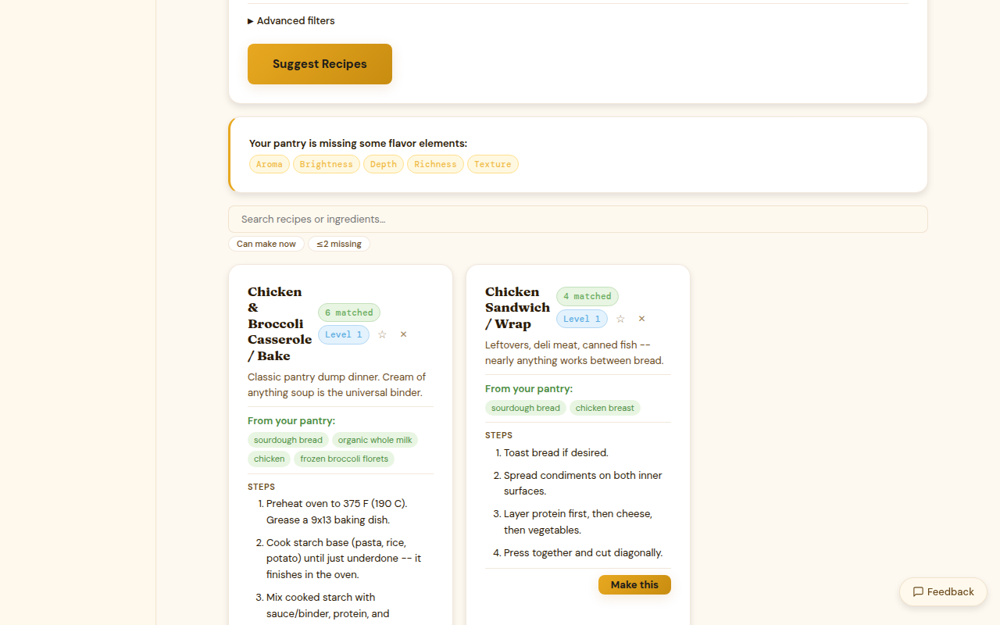

# Leftover Mode

Leftover mode re-ranks recipe suggestions to surface dishes that use your nearly-expired items first. It's the fastest way to answer "what should I cook before this goes bad?"

## Activating leftover mode

Click the **clock icon** or the **Leftover mode** toggle in the recipe browser. The recipe list immediately re-sorts to prioritize recipes that use items expiring within the next 7 days.

## How it works

When leftover mode is active, Kiwi weights the pantry match score toward items closer to their expiry date. A recipe that uses your 3-day-old spinach and day-old mushrooms ranks higher than a recipe that only uses shelf-stable pantry staples — even if the pantry match percentage is similar.

Items without an expiry date set are not weighted for leftover mode purposes. Setting expiry dates when you add items makes leftover mode much more useful.

## Rate limits

| Tier | Leftover mode requests |
|------|----------------------|
| Free | 5 per day |
| Paid | Unlimited |
| Premium | Unlimited |

A "request" is each time you activate leftover mode or click **Refresh**. The re-sort count resets at midnight.

## What counts as "nearly expired"

The leftover mode window uses the same thresholds as the expiry indicators:

- **Expiring within 2 days** — highest priority
- **Expiring within 7 days** — elevated priority
- **Expiring within 14 days** — mildly elevated priority

Items past their expiry date are still included (Kiwi doesn't remove them automatically) but displayed with a red indicator. Use your judgment — some items are fine past date, others aren't.

## Combining with filters

Leftover mode stacks with the dietary and cuisine filters. You can activate leftover mode and filter by "Vegetarian" or "Under 30 minutes" to narrow down to recipes that both use expiring items and match your constraints.
