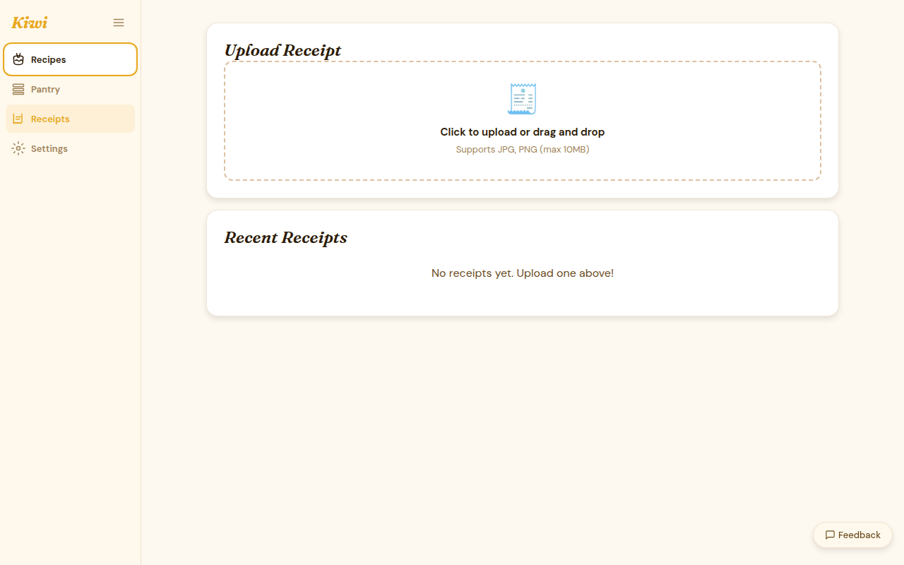

# Receipt OCR

Receipt OCR automatically extracts grocery line items from a photo of your receipt and adds them to your pantry after you approve. It's available on the Paid tier and BYOK-unlockable on Free.

## Upload a receipt

1. Click **Receipts** in the sidebar
2. Click **Upload receipt**
3. Take a photo or select an image from your device

Supported formats: JPEG, PNG, HEIC, WebP. Maximum file size: 10 MB.

## How OCR processing works

When a receipt is uploaded:

1. **OCR runs** — the LLM reads the receipt image and identifies line items, quantities, and prices
2. **Review screen** — you see each extracted item with its detected quantity
3. **Approve or edit** — correct any mistakes, remove items you don't want tracked
4. **Confirm** — approved items are added to your pantry in bulk

The whole flow is designed around human approval — Kiwi never silently adds items to your pantry. You always see what's being imported and can adjust before confirming.

## Reviewing extracted items

Each extracted line item shows:

- **Product name** — as extracted from the receipt
- **Quantity** — detected from the receipt text (e.g., "2 × Canned Tomatoes")
- **Confidence** — how certain the OCR is about this item
- **Edit** — correct the name or quantity inline
- **Remove** — exclude this item from the import

Low-confidence items are flagged with a yellow indicator. Review those carefully — store abbreviations and handwriting can trip up the extractor.

## Free tier behavior

On the Free tier without a BYOK backend configured:

- Receipts are stored and displayed
- OCR does **not** run automatically
- You can enter items from the receipt manually using the item list view

To enable automatic OCR on Free tier, configure a [BYOK LLM backend](../getting-started/llm-setup.md).

## Tips for better results

- **Flatten the receipt**: lay it on a flat surface rather than crumpling
- **Include the full receipt**: get all four edges in frame
- **Good lighting**: avoid glare on thermal paper
- **Fresh receipts**: faded thermal receipts (older than a few months) are harder to read

## Re-running OCR

If OCR produced poor results, you can trigger a re-run from the receipt detail view. Each re-run uses a fresh extraction — previous results are discarded.
