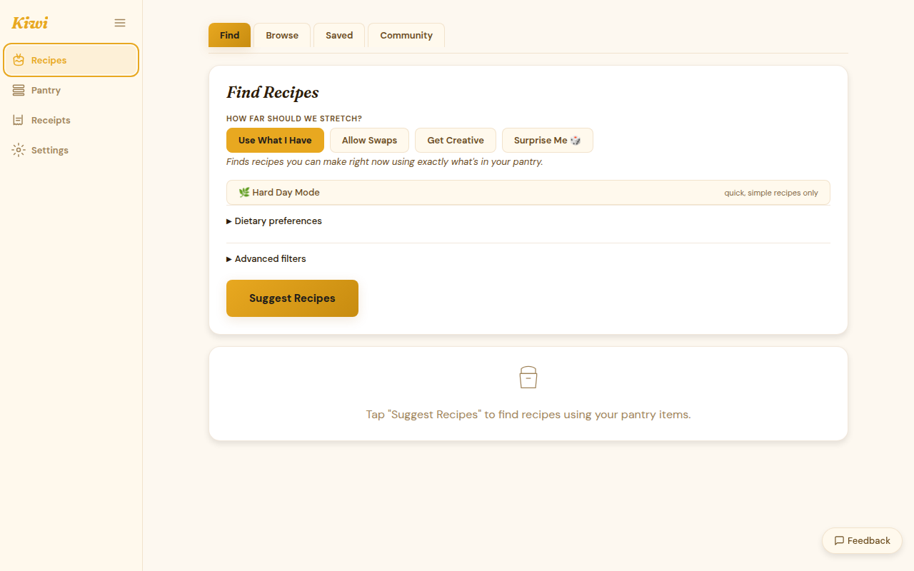

# Recipe Browser

The recipe browser lets you explore the full recipe corpus filtered by cuisine, meal type, dietary preference, and main ingredient. Your **pantry match percentage** is shown on every recipe card so you can see at a glance what you can cook tonight.

## Browsing by domain

The recipe corpus is organized into three domains:

| Domain | Examples |
|--------|---------|
| **Cuisine** | Italian, Mexican, Japanese, Indian, Mediterranean, West African, ... |
| **Meal type** | Breakfast, Lunch, Dinner, Snack, Dessert, Drink |
| **Dietary** | Vegetarian, Vegan, Gluten-free, Dairy-free, Low-carb, Nut-free |

Click a domain tile to see its categories. Click a category to browse the recipes inside it.

## Pantry match percentage

Every recipe card shows what percentage of the ingredient list you already have in your pantry. This updates as your inventory changes.

- **100%**: you have everything — cook it now
- **70–99%**: almost there, minor shopping needed
- **< 50%**: you'd need to buy most of the ingredients

## Filtering

Use the filter bar to narrow results:

- **Dietary** — show only recipes matching your dietary preferences
- **Min pantry match** — hide recipes below a match threshold
- **Time** — prep + cook time total
- **Sort** — by pantry match (default), alphabetical, or rating (for saved recipes)

## Recipe detail

Click any recipe card to open the full recipe:

- Ingredient list with **in pantry / not in pantry** indicators
- Step-by-step instructions
- Substitution suggestions for missing ingredients
- Nutritional summary
- **Bookmark** button to save with notes and rating

## Getting suggestions

The recipe browser shows the **full corpus** sorted by pantry match. For AI-powered suggestions tailored to what's expiring, use [Leftover Mode](leftover-mode.md) or the **Suggest** button (Paid / BYOK).

See [Recipe Engine](../reference/recipe-engine.md) for how the four suggestion levels work.
